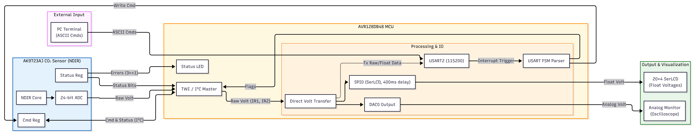

# AVR128DB48 - AK9723AJ CO₂ Medical Monitoring System

**Real-time CO₂ detection with bidirectional TWI communication, SPI display with 400ms stabilization delay, USART115200 interrupt-driven terminal with FSM command parsing, and DAC analog waveform output for patient breathing monitoring**

  
)

---

**Version 1.0 | Last Updated: May 2026 | Author: Jin Yuan Chen**

---

## Table of Contents

- [Executive Summary](#executive-summary)
- [System Overview](#system-overview)
- [Hardware Architecture](#hardware-architecture)
- [Communication Interfaces](#communication-interfaces-twi--spi--usart--dac)
- [AK9723AJ CO₂ Sensor Operation](#ak9723aj-co₂-sensor-operation)
- [Real-Time Data Acquisition & Processing](#real-time-data-acquisition--processing)
- [USART Terminal Control (FSM)](#fsm-based-usart-terminal-control)
- [DAC Waveform Output](#medical-co₂-waveform-output-dac)
- [SerLCD Display System](#display-system-serlcd-spi0)
- [System Optimization](#system-optimization--stability-behavior)
- [Error Handling](#error-handling--status-indication)

---

  

# Embedded CO₂ Monitoring System (Capnography-Style)

## Executive Summary

Embedded real-time **respiratory CO₂ monitoring system** designed for capnography-style waveform analysis.  
Built on **AVR128DB48 MCU** with an **AK9723AJ NDIR CO₂ sensor**, the platform performs digital gas sensing, analog waveform reconstruction, and multi-interface system visualization for medical monitoring applications.

The system supports:
- Real-time CO₂ concentration measurement (ppm)
- Analog respiratory waveform generation (DAC output)
- Interrupt-driven UART command interface (115200 baud)
- SPI-based SerLCD visualization
- I²C sensor acquisition with calibration support

Target applications include ICU respiratory monitoring, ventilator feedback systems, and anesthesia tracking.

---

## System Architecture

### Sensor Layer
- **AK9723AJ NDIR CO₂ sensor**
- I²C (TWI) communication
- Register-level configuration and calibration support

### Processing Core (AVR128DB48)
- Real-time signal acquisition and conversion
- CO₂ ppm computation pipeline
- FSM-based USART command parser
- System state + error handling logic

### Output Subsystems
- **DAC output:** Analog reconstruction of CO₂ respiratory waveform
- **SerLCD (SPI):** Multi-page real-time display interface

### Control Interface
- USART terminal interface (115200 baud)
- Interrupt-driven ASCII command processing

---

## Key Features

- Real-time CO₂ ppm computation from NDIR sensor data
- Analog waveform generation for respiratory visualization
- FSM-based UART command interpreter
- Multi-modal output: LCD + DAC + terminal
- Configurable sensor calibration and runtime tuning
- GPIO-based system status indication (boot + fault states)

---

## Communication Interfaces

| Interface | Mode | Function |
|---|---|---|
| **TWI (I²C)** | Master | AK9723AJ sensor control, calibration, data acquisition |
| **SPI0** | Master | SerLCD display updates with timing constraints |
| **USART** | Interrupt-driven, 115200 baud | Command-line interface and diagnostics |
| **DAC** | Analog output | CO₂ waveform reconstruction |

---

## Application Scope

Designed for embedded medical monitoring systems requiring:
- Respiratory CO₂ tracking (capnography-style)
- Real-time physiological waveform visualization
- Multi-interface embedded system integration
- Low-latency sensor-to-output pipelines

---

## System Characteristics

- Deterministic embedded pipeline architecture
- Mixed-signal system (digital + analog output)
- Interrupt-driven firmware design
- Multi-protocol peripheral coordination (I²C, SPI, UART, DAC)
